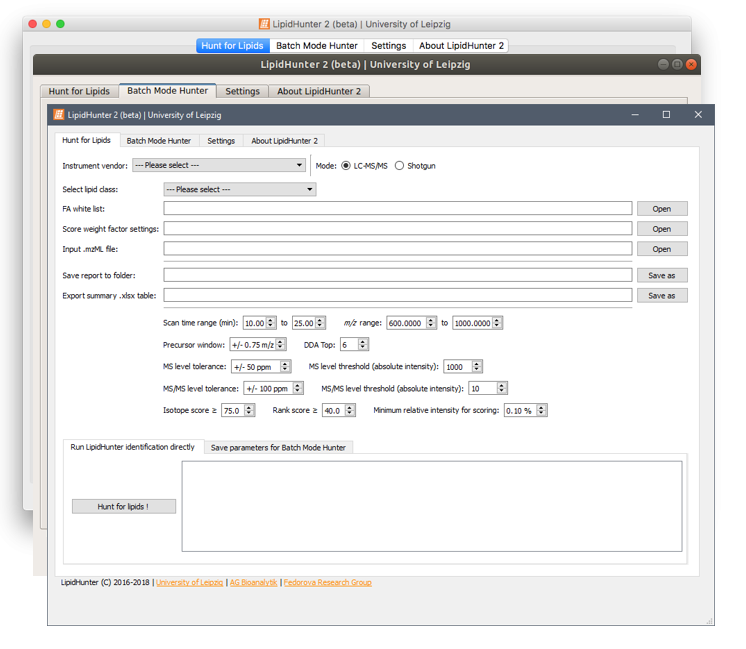

# About LipidHunter 2 #

LipidHunter 2 has significant improvement from the original LipidHunter.
The major improvements are listed below:

* Special Feature for TG & DG

    + ID based both on FA neutral losses & fragments
    + Accurate ID of isomeric species
    + Correction for all identified FA
    + Correction for the fragment intensity of multiply identified FAs
    + Check for cross-contamination signals e.g. PL fragments
    
* Other Major Feature Updates

    + Multiprocessing
    + Batch mode
    + 10 times faster processing speed
    + Command line mode
    + KNIME workflow integration
    + Multiple vendor support
    + Improved output style
    + Simplified configuration
    + View run parameters in report
    
* Currently supported Lipid classes in LipidHunter 2:

|  Lysophospholipids     |  Phospholipids                |  Glycerolipids            |
|------------------------|-------------------------------|---------------------------|
| Lyso PA (LPA)          | Phosphatidic acid (PA)        | Triacylglycerol (TG)      |
| [M-H]-                 | [M-H]-                        | [M+NH4]+, [M+H]+, [M+Na]+ |
| Lyso PC (LPC)          | Phosphatidylcholine (PC)      | Diacylglycerol (DG)       |
| [M+HCOO]-, [M+CH3COO]- | [M+HCOO]-, [M+CH3COO]-        | [M+NH4]+                  |
| Lyso PE (LPE)          | Phosphatidylethanolamine (PE) |                           |
| [M-H]-                 | [M-H]-                        |                           |
| Lyso PG (LPG)          | Phosphatidylglycerol (PG)     |                           |
| [M-H]-                 | [M-H]-                        |                           |
| Lyso PI (LPI)          | Phosphatidylinositol (PI)     |                           |
| [M-H]-                 | [M-H]-                        |                           |
| Lyso PS (LPS)          | Phosphatidylserine (PS)       |                           |
| [M-H]-                 | [M-H]-                        |                           |

## LipidHunter 2 new graphical user interface ##

This repository contains the source code of LipidHunter.

LipidHunter Windows .exe executable version can be found in release page:

https://github.com/SysMedOs/lipidhunter/releases

### Please read the following instructions before you start to run LipidHunter. ###

## Instructions ##

### Windows version ###

* The binary executable version of LipidHunter 2 is provided for Windows users. (Windows 7, 8, and 10, 64bit system required)

    + [`.exe` and `.zip` installation file](https://github.com/SysMedOs/lipidhunter/releases/latest)
 
### How to install LipidHunter 2 from source code ###
* Download the LipidHunter 2 as zip file for your system
    + Please use the source code page in the release page https://github.com/SysMedOs/lipidhunter/releases/
    + Download LipidHunter source Code as .zip. Please notice the date and version of LipidHunter source code.
    + Professional users can use `git` to clone the whole repository, please make sure that you switched to the correct branch.
    + Only the released version is recommended for real data processing. Other development branches may lead to unknown issues and miss interpretation of the data.

* Rename the downloaded file to `LipidHunter.zip`
* Unzip `LipidHunter.zip` file to any folder.
* Downloaded LipidHunter test spectra files: [LipidHunter_Test_mzML_File](https://github.com/SysMedOs/lipidhunter/releases/download/LipidHunter2_RC/TestData.zip)

* Python environment

    + LipidHunter 2 is developed under python 3.6, the current version can still run on python 2.7 (not recommended).
    + The best way is to use virtual environment such as `conda`
    + The requirements is listed in conda_env_{OS}.yml for `conda` users and [requirements.txt](requirements.txt) for `pip` users.
        - conda: run `conda env create -f conda_env.yml` you will get an environment named `envlipidhunter` 
        - pip: activate your virtual environment, then `pip install -r requirements.txt`
    + Main dependencies are:
        - Data processing: numpy, pandas, scipy, numba, natsort
        - mzML reader: pymzml
        - Image plot: matplotlib, plotly(required by pymzml)
        - Excel output: openpyxl, xlrd, xlwt
        - Graphic interface: pyside
    + Test source code installation:
        - LipidHunter 2  is configured to use [travis-ci](https://travis-ci.com) with `py.test` to test on Windows, Linux, and macOS. 
        - Use command `pytest` in LipidHunter folder to run all tests.
        - Optionally, you can test individual unit test in the `test` folder
         

* [LipidHunter user guide](doc/LipidHunter_UserGuide.pdf)

### mzML File conversion ###

We recommend to use ProteoWizard version 3.0.19217 64 bit version or above to convert your raw files to mzML.
You can find the latest version of ProteoWizard from:

http://proteowizard.sourceforge.net/download.html

If you have difficulties to run your mzML file.
Please try to run your analysis again in the LipidHunter_debug.exe and post the error messages 
to the [issue tracker](https://github.com/SysMedOs/lipidhunter/issues) or contact us.

### Graphic interface issue on high resolution screens ###

Please open the `config.ini` file and change `gui_scale = 1` to `gui_scale = 1.5` or `gui_scale = 2`save it 
and restart LipidHunter.
If there is no `gui_scale = 1` section, you can manually add it in the end.

We recommend laptop user with high resolution screen to try the scale ratio `2` or `1.5`.
You can try to set scale factor from `0.75` (75%) to `2.75` (275%) with the step of `0.25` (25%) 
to find the best value for your screen.

### Errors/bugs ###
    
In case you experienced any problems with running LipidHunter

please report an issue in the [issue tracker](https://github.com/SysMedOs/lipidhunter/issues) or contact us.

### License ###

+ LipidHunter is Dual-licensed
    * For academic and non-commercial use: `GPLv2 License`: 
    
        [The GNU General Public License version 2](https://www.gnu.org/licenses/old-licenses/gpl-2.0.en.html)

    * For commercial use: please contact the develop team by email.

+ Please cite our publication in an appropriate form. 
    * Ni, Zhixu, Georgia Angelidou, Mike Lange, Ralf Hoffmann, and Maria Fedorova. "LipidHunter identifies phospholipids by high-throughput processing of LC-MS and shotgun lipidomics datasets." Analytical Chemistry (2017).
        - DOI: 10.1021/acs.analchem.7b01126

### Further questions? ###

* Report any issues here: [https://github.com/SysMedOs/lipidhunter/issues](https://github.com/SysMedOs/lipidhunter/issues)

### Fundings ###
We acknowledge all projects that supports the development of LipidHunter:

+ BMBF - Federal Ministry of Education and Research Germany:

    https://www.bmbf.de/en/

+ e:Med Systems Medicine Network:

    http://www.sys-med.de/en/

+ SysMedOS Project : 

    https://home.uni-leipzig.de/fedorova/sysmedos/
